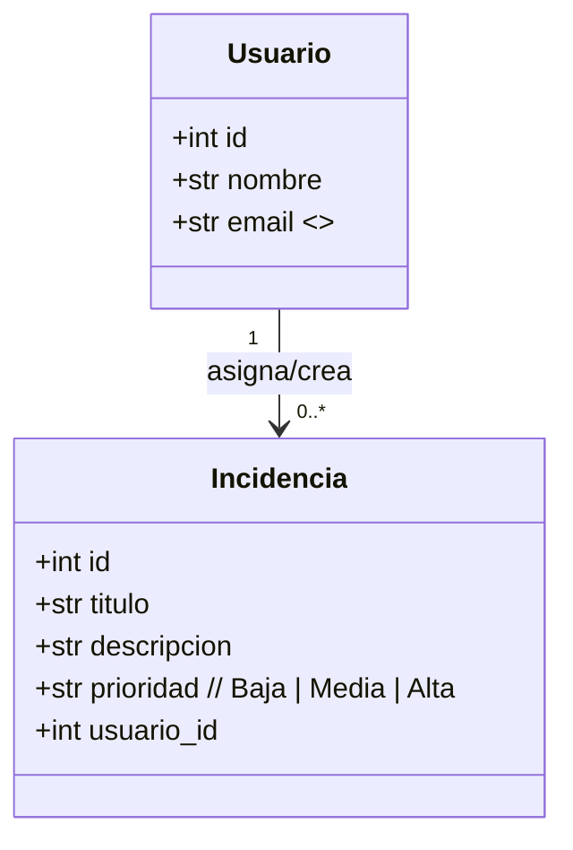
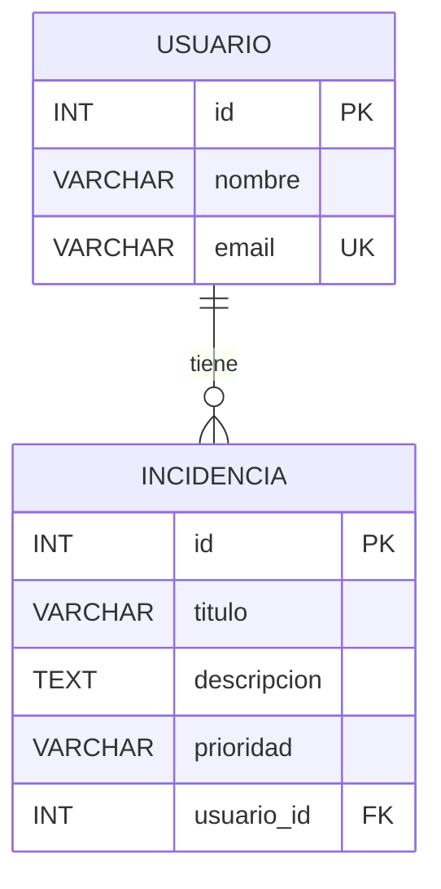

# Manual_Tecnico_Tickets_EC0835

# Manual Técnico — Sistema de Tickets (EC0835)

## Índice

1. Introducción
2. Objetivo general del sistema
3. Objetivos específicos
4. Requerimientos de instalación
5. Diagrama de clases (UML)
6. Diagrama Entidad–Relación (ER)
7. Desarrollo y código de la aplicación (referencia)

---

## 1. Introducción

El sistema de **Tickets** es una aplicación de escritorio desarrollada en **Python 3.10+** con **Tkinter** (GUI) y **SQLite** como motor de base de datos local. La persistencia y consultas se implementan con **SQLAlchemy** (ORM) y las **migraciones** con **Alembic**.

El propósito es gestionar incidencias (tickets) asociadas a usuarios, demostrando para el EC0835: **inserción, selección, actualización, eliminación, combinación (JOIN) y agrupación (GROUP BY)**.

---

## 2. Objetivo general del sistema

Desarrollar y desplegar un sistema sencillo de **gestión de incidencias** que permita administrar **Usuarios** e **Incidencias**, cumpliendo con el CRUD completo y las consultas solicitadas por el estándar EC0835.

---

## 3. Objetivos específicos

- Registrar, editar y eliminar **Usuarios** con restricción de **email único**.
- Registrar, editar, eliminar y consultar **Incidencias** con campos: *título, descripción, prioridad, usuario asignado*.
- Implementar consultas:
    - **SELECT** con filtros por usuario/prioridad.
    - **JOIN** para listar incidencias junto con el **nombre del usuario**.
    - **GROUP BY** para obtener métricas (p. ej., incidencias por usuario / por prioridad).
- Mantener el esquema de base de datos mediante **migraciones Alembic**.
- (Opcional) Empaquetar la app a `.exe` para su distribución en Windows.

---

## 4. Requerimientos de instalación

### 4.1. Software

- **Sistema operativo**: Windows 10/11 (probado).
- **Python**: 3.10 o superior (incluye Tkinter).
- **Pip**: incluido con Python.
- **Librerías**:
    - `sqlalchemy>=2.0`
    - `alembic>=1.13` (si usarás migraciones)
    - `pyinstaller` para generar `.exe`.

**Archivo `requirements.txt` recomendado:**

```
sqlalchemy>=2.0
alembic>=1.13
```

### 4.2. Estructura de proyecto (referencia)

```
tickets_app/
│  main.py
│  models.py
│  db.py
│  crud.py
│  requirements.txt
│  alembic.ini           (lo crea Alembic)
└─ alembic/              (lo crea Alembic)
   ├─ env.py
   └─ versions/
```

### 4.3. Instalación y puesta en marcha (Windows PowerShell)

```powershell
# 1) Crear y activar entornopython -m venv venv
.env\Scripts\Activate.ps1
# 2) Instalar dependencias
pip install -r requirementos.txt
# 3) Inicializar Alembic (solo primera vez)
alembic init alembic
# 4) Configurar Alembic
# - En alembic.ini: 
sqlalchemy.url = sqlite:///app.db# -
 En alembic\env.py: importar Base desde models.py y setear target_metadata = Base.metadata
 # 5) Crear migración inicial y aplicarlaalembic revision 
 --autogenerate -m "init"  alembic upgrade head
# 6) Ejecutar la aplicaciónpython main.py
```

 *generar .exe*

```powershell
pip install pyinstaller
pyinstaller --onefile --noconsole main.py# Ejecutable en dist/main.exe
```

---

## 5. Diagrama de clases (UML)

> Puedes pegar este bloque en Notion como bloque de código con el lenguaje Mermaid (Notion lo renderiza).
> 



---

## 6. Diagrama Entidad–Relación (ER)



**Notas del modelo**
- `USUARIO.email` es **único**.

- `INCIDENCIA.usuario_id` es **FK** a `USUARIO.id`.

- Cardinalidad: **1 a N** (un usuario puede tener muchas incidencias).

---

## 7. Desarrollo y código de la aplicación (referencia)

Inserta aquí tu código final o enlaza a los archivos del proyecto:

- **`db.py`**: configuración del `engine`, `SessionLocal` y `PRAGMA foreign_keys=ON`.
- **`models.py`**: `Base = declarative_base()`, clases `Usuario` e `Incidencia`.
- **`crud.py`**: funciones CRUD + consultas `JOIN` y `GROUP BY`.
- **`main.py`**: interfaz **Tkinter** (pestañas Usuarios/Incidencias, filtros, diálogos).
```